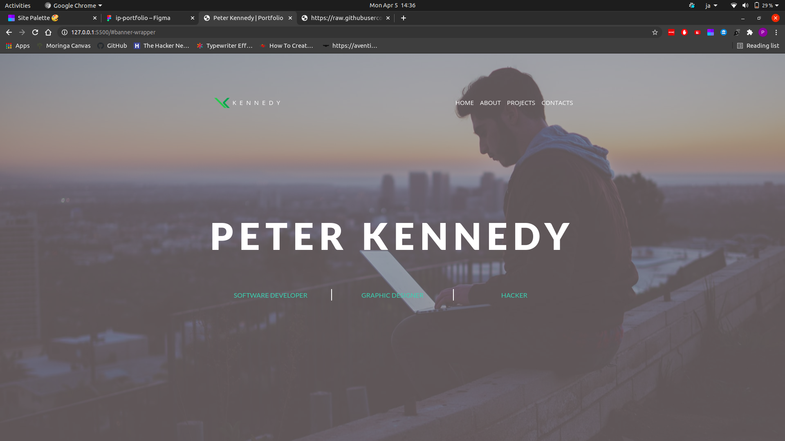

# Portfolio
#### Peter Kennedy's portfolio, 2021.
#### By **Peter Kennedy**
## Description
This is a typical portfolio website introducing who I am, what I do and what I have done. It also has a way to contact me in case one want's to reach out. It has four sections, the landing page banner, the About Me section, Projects Done section and finally a Contact Me section. The landing pages is as shown below:

## Setup/Installation
To view the website, go to [peterken674.github.io/ip-portfolio](https://peterken674.github.io/ip-portfolio). 
Use the navigation at the top to move between the sections.
## Known Bugs
- No knowns bugs so far, but you can reach out if any is observed.
- However, the site is not fully responsive to smaller devices.
## Technologies Used
- HTML
- CSS
- JavaScript
## Support and contact details
If you have any suggestions, questions or in case of a fire, you can reach the developer via [email](mailto:peterken.ngugi@gmail.com).
### License
 

Copyright &copy; 2021 **[peterken674](www.github.com/peterken674)**